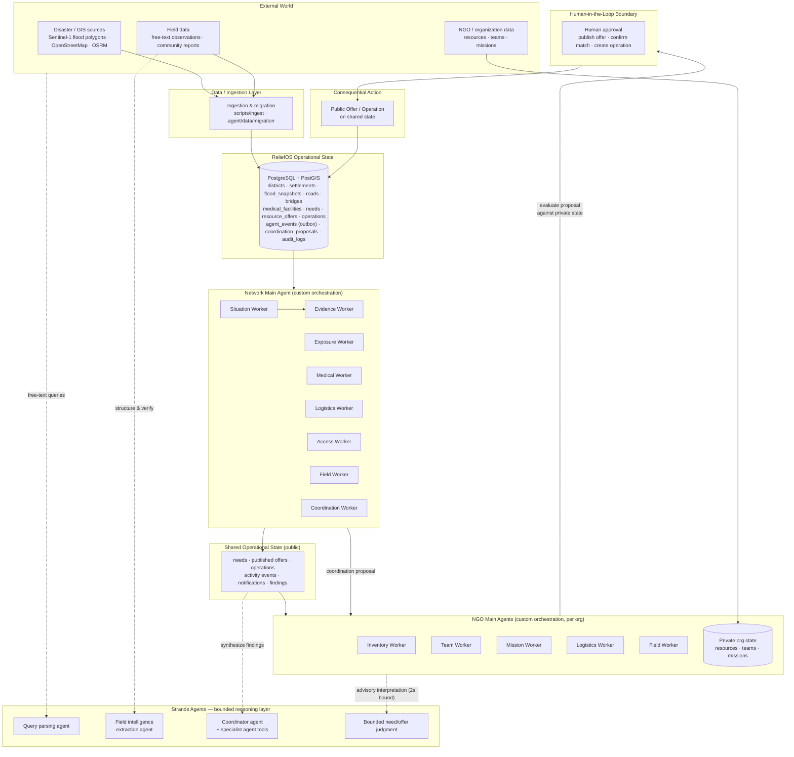

# ReliefOS Architecture

## System Architecture Diagram



## Two Boundaries, One System

ReliefOS is one system with two clearly separated planes:

```text
                RELIEFOS
                   │
        ┌──────────┴──────────┐
        │                     │
 Deterministic Runtime    Strands Reasoning
        │                     │
 Event routing             Query parsing
 Outbox                    Field extraction
 Persistence               Coordinator
 HITL                      Specialist reasoning
 Privacy                   Bounded judgment
        │                     │
        └──────────┬──────────┘
                   │
             Operational State
```

## Architecture Explanation

**Data flow.** External sources (Sentinel-1-derived flood polygons, OpenStreetMap infrastructure, field reports, organizational data) enter through the ingestion layer into PostgreSQL + PostGIS, which is the single authoritative operational state. Spatial queries (point-in-polygon, intersects, radius) run database-side on GiST-indexed geometries.

**Deterministic runtime (custom ReliefOS architecture).** Domain events (`AgentEvent`) are persisted to a transactional outbox and dispatched by a deterministic router — a static table maps event types to the specialist domains that should process them; no LLM sits in the control loop. The **Network Main Agent** delegates to specialist workers with failure isolation (a failing worker produces an explicit data-gap finding, never a fabricated one). Idempotency, stale-claim recovery, and replay are built in. Agent contracts (`AgentFinding` with provenance, severity, confidence, evidence, uncertainty, data gaps) are ReliefOS-defined.

**Strands reasoning layer.** Strands Agents is used for bounded reasoning tasks: parsing free-text coordinator queries into structured intent, extracting structured fields from raw field observations, coordinator/specialist synthesis over pre-gathered evidence, and a time-bounded advisory need/offer judgment. All LLM output passes deterministic guardrails (fabricated-number detection, controlled vocabularies, preserved raw source), and the deterministic path keeps working when the LLM is unavailable. Strands provides the bounded reasoning layer **inside** the deterministic operational architecture — the orchestration hierarchy, outbox, persistence, HITL, and privacy boundaries are custom application architecture.

**Multi-organization privacy.** Organization Main Agents reason over `PrivateOrganizationContext` (inventory, teams, missions — never visible to the network) plus `SharedNetworkContext` (public needs, offers, operations). Network-facing routes serialize only sanitized public projections. There is no uncontrolled worker-to-worker communication: `Worker → Main Agent → shared operational object → other Main Agent`.

**Human-in-the-loop.** Every consequential action — publishing an offer, confirming a match, creating an operation — transitions through an explicit approval gate (`PROPOSED → PENDING_ORG_REVIEW → ORG_RECOMMENDED → PENDING_HUMAN_APPROVAL → PUBLISHED`), is performed by a human through the API, and is recorded in the audit log. Agents propose; humans dispose.
